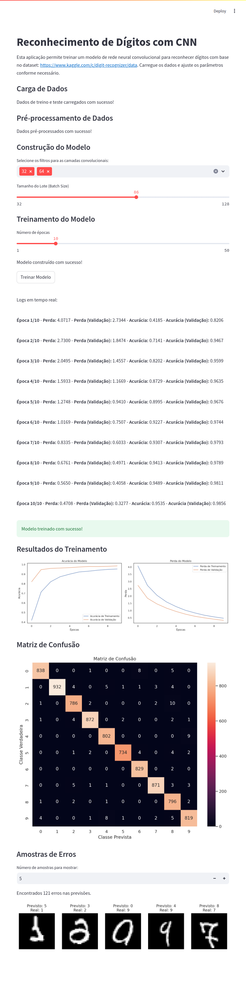

## Reconhecimento de Dígitos com CNN - Aplicação em Streamlit

Esta aplicação utiliza uma Rede Neural Convolucional (CNN) feita através do framework TensorFlow para reconhecer dígitos
escritos à mão, baseado no dataset do
[Kaggle Digit Recognizer](https://www.kaggle.com/c/digit-recognizer/data). A aplicação permite que o usuário carregue os
dados de treino e teste, ajuste os parâmetros
do
modelo, treine a rede e visualize os resultados diretamente na interface do Streamlit.

Para utilizar adicionar os arquivos `train.csv` e `test.csv` do dataset do Kaggle na pasta `data`:

- data/
    - train.csv
    - test.csv

### Página do streamlit:

